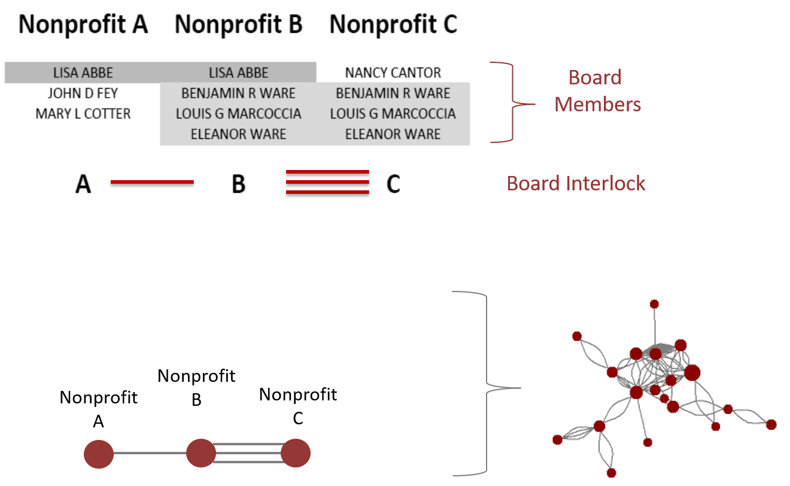

---
output:
  html_document:
    df_print: paged
    theme: paper
    highlight: haddock
    toc: yes
    toc_float: yes
    code_fold: hide
    css: vignettes.css
---


```{r setup, include=FALSE}
knitr::opts_chunk$set(echo = TRUE, message=F, warning=F, fig.width=10, fig.height=10 )
```

```{r}
library( igraph )
library( pander )
```


# Building a Board Interlock Network


Board interlock is a phenomenon that occurs when multiple organizations share the sample board members. These individuals occupy an important space on the organizational landscape because they mediate information and resources in many cases.


  


This research vignette presents a method for generating network files from lists of board members using an approximate matching technique.


### Exact Matching

If we are working with real data that has not been generated through a very structured process, the data is going to be messy and imprecise. 

A primary source of data for nonprofit scholarship, the 990 tax forms, is fully of messy and imprecise data. 

For example, if we want to determine whether one individual serves on multiple nonprofit boards, we can do this by matching board member names across organizations. 

The problem we will run into is that any small difference in how the name is spelled will result in an false negative match. Take these cases below:

```{r}

"CHARLES F COLE"  ==  "CHARLES F COLE"

"CHARLES F COLE"  ==  "CHARLES COLE"

"CHARLIE F COLE"  ==  "CHARLES F COLE"

"CHUCK F COLE"  ==  "CHARLES F COLE"

"CHARLES F COLE"  ==  "COLE, CHARLES F"

```

A human would look at these cases and decide that they are all matches. A computer will look at these cases and decide that only the first one is a match.


## Fuzzy Matching

We can overcome this problem using approximate matching, or "fuzzy" matching techniques.

There are a large variety of methods available for this, but the base R package contains a version that uses an edit distance calculation to determine if two words are close.

```{r}

agrep( "lazy", c("daisy", "lasy", "larry" ), max.distance = 0.1, value = TRUE )

```

We can see that this method would give us reasonable matches in most of these cases now. A human would probably recognize that the last case is a match, where the computer would need to know the rule that a comma signifies that name order has been reversed.


```{r}


agrepl( "CHARLES F COLE", "CHARLES F COLE" )

agrepl( "CHARLES F COLE", "CHARLES COLE" )

agrepl( "CHARLIE F COLE", "CHARLES F COLE" )

agrepl( "CHUCK F COLE",  "CHARLES F COLE" )

agrepl( "CHUCK F BORROWITZSKY",  "CHARLES F BORROWITZSKY" )


```

The second to last case is a little trickier because one nonprofit is using the full name "Charles" while the other nonprofit is using the nickname "Chuck". We can deal with this by relaxing the edit distance threshold or changing the cost of specific edits, but any of these changes will need to balance sensitivity and specificity of the matches. 


```{r}


agrepl( "CHUCK F COLE",  "CHARLES F COLE", max.distance = 0.4 )


```


Consider some of these cases:


```{r, echo=F}

matches <-
structure(list(BOARD.MEMBER.V1 = c("EILEEN HALL", "EILEEN HALL", 
"GEORGE HEARST", "PAUL F COLE", "J THALIA CUNNINGHAM", "MARY JANE PAULING", 
"BERT SCHOU", "AL OCONNOR", "TOM COX"), BOARD.MEMBER.V2 = c("EILEEN HALL", 
"EILEEN HANLEY", "GEORGE R HEARST", "PAUL COLE", "JOSIE THALIA CUNNINGHAM", 
"MARY J PAULING", "ROBERT SCHOFIELD", "E MICHAEL OCONNOR", "TOM CONWAY"
), EXACT.MATCH = c(TRUE, FALSE, FALSE, FALSE, FALSE, FALSE, FALSE, 
FALSE, FALSE), FUZZY.MATCH = c(TRUE, TRUE, TRUE, TRUE, TRUE, 
FALSE, TRUE, TRUE, TRUE)), .Names = c("BOARD.MEMBER.V1", "BOARD.MEMBER.V2", 
"EXACT.MATCH", "FUZZY.MATCH"), row.names = c(NA, -9L), class = "data.frame")


matches %>% pander
```


# Load Data

We are going to use board data from a mid-sized US city in 2000. This network data has been generated through an iterative pair-wise comparison of board members across organizations. 

*Thanks to Nara Yoon for sharing data from her dissertation project for this example.*


```{r, echo=F}

setwd( "C:/Users/jdlecy/Dropbox/00 - Nonprofit Open Data/08 - ARNOVA Website/arnova-2017-workshop/workshop/data" )

source( "net_data_2000.R" )
source( "attribute_data.R" )


```


```{r, eval=F}


source( "https://raw.githubusercontent.com/lecy/arnova-2017-workshop/master/workshop/data/net_data_2000.R" )

source( "https://raw.githubusercontent.com/lecy/arnova-2017-workshop/master/workshop/data/attribute_data.R" )

```


# Network from Edgelist

We will use the **graph_from_data_frame()** function in the igraph package to load our data as a network object. In this example, nodes represent nonprofits and each tie represents a board member. Two nonprofits can share multiple board members, which is reflected by the number of ties between nodes.

We can see that when we connect all of the interlocking board members across the city some interesting structures emerge. 

```{r}


# read in network ties plus attributes

df <- net.2000[ c("org1.ein","org2.ein") ]

net <- graph_from_data_frame( d=df, vertices=att, directed=F ) 


V(net)$size <- 4
V(net)$frame.color <- "white"
V(net)$color <- "orange"
V(net)$label <- "" 
E(net)$arrow.mode <- 0

par( mar=c(0,0,0,0) )
plot( net, layout=layout_nicely(net) )


```


## Subsector Graphs


```{r}

# scale between 2 and 14 for size

V(net)$size <- 4 + 10*( degree( net, mode="all" ) / max(degree( net, mode="all" )) )
V(net)$NTMAJ5 <- gsub( " ", "", V(net)$NTMAJ5 )

keep.these <- V(net)$NTMAJ5 == "AR"
keep.these[ is.na(keep.these) ] <- FALSE
arts <- V(net)[ keep.these ]
V(net)[ keep.these ]$color <- "orange"
V(net)[ keep.these ]$frame.color <- "orange"
g.ar <- induced_subgraph( graph=net, vids=arts )

keep.these <- V(net)$NTMAJ5 == "HU"
keep.these[ is.na(keep.these) ] <- FALSE
V(net)[ keep.these ]$color <- "steelblue"
V(net)[ keep.these ]$frame.color <- "steelblue"
human.services <- V(net)[ keep.these ]
g.hs <- induced_subgraph( graph=net, vids=human.services )

keep.these <- V(net)$NTMAJ5 == "ED"
keep.these[ is.na(keep.these) ] <- FALSE
V(net)[ keep.these ]$color <- "gray20"
V(net)[ keep.these ]$frame.color <- "gray20"
education <- V(net)[ keep.these ]
g.ed <- induced_subgraph( graph=net, vids=education )

keep.these <- V(net)$NTMAJ5 == "HE"
keep.these[ is.na(keep.these) ] <- FALSE
V(net)[ keep.these ]$color <- "darkred"
V(net)[ keep.these ]$frame.color <- "darkred"
health <- V(net)[ keep.these ]
g.he <- induced_subgraph( graph=net, vids=health )

keep.these <- V(net)$NTMAJ5 == "OT"
keep.these[ is.na(keep.these) ] <- FALSE
other <- V(net)[ keep.these ]
V(net)[ keep.these ]$color <- "gray80"
V(net)[ keep.these ]$frame.color <- "gray80"
g.ot <- induced_subgraph( graph=net, vids=other )


par( mar=c(0,0,2,0), mfrow=c(2,2) )

plot( g.hs, 
      layout=layout_with_kk(g.hs), 
      edge.color="gray50", 
      vertex.label=NA )
title( main="Human Services", line=0 )

plot( g.ar, 
      layout=layout_with_kk(g.ar), 
      edge.color="gray50", 
      vertex.label=NA )
title( main="Arts", line=0 )

plot( g.ed, 
      layout=layout_with_kk(g.ed), 
      edge.color="gray50", 
      vertex.label=NA )
title( main="Education", line=0 )

plot( g.he, 
      layout=layout_with_kk(g.he), 
      edge.color="gray50", 
      vertex.label=NA )
title( main="Health", line=0 )


```


## Plot Separately

```{r, fig.height=10}


plot( g.hs, 
      layout=layout_with_kk(g.hs), 
      edge.color="gray50", 
      vertex.label=NA )
title( main="Human Services", line=0 )


plot( g.ar, 
      layout=layout_with_kk(g.ar), 
      edge.color="gray50", 
      vertex.label=NA )
title( main="Arts", line=0 )


plot( g.ed, 
      layout=layout_with_kk(g.ed), 
      edge.color="gray50", 
      vertex.label=NA )
title( main="Education", line=0 )


plot( g.he, 
      layout=layout_with_kk(g.he), 
      edge.color="gray50", 
      vertex.label=NA )
title( main="Health", line=0 )


```


# Show Only the Core

```{r}

keep.these <- V(net)[ degree( net, mode="all" ) > 25 ]

g.sub <- induced_subgraph( graph=net, vids=keep.these )

par( mar=c(0,0,0,0) )
plot( g.sub, layout=layout_with_kk(g.sub), 
      edge.color="gray90", 
      vertex.label=V(g.sub)$NAME, vertex.label.cex=0.5, vertex.label.dist=1, vertex.label.color="darkgray",
      vertex.size=15*(degree(g.sub)/max(degree(g.sub)) ) )

```


## Scale Size of Nodes by AGE

```{r}


V(net)$AGE[ is.na( V(net)$AGE ) ] <- median( V(net)$AGE, na.rm=T )

V(net)$size <- 1 + 10*( V(net)$AGE / max( V(net)$AGE ) )
V(net)$color <- "orange"

par( mar=c(0,0,0,0) )
plot( net, layout=layout_nicely(net) )


```


