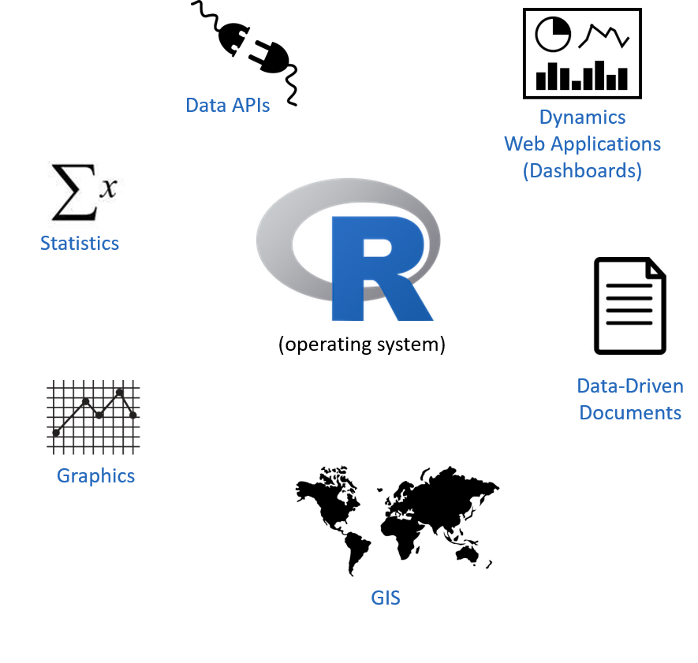
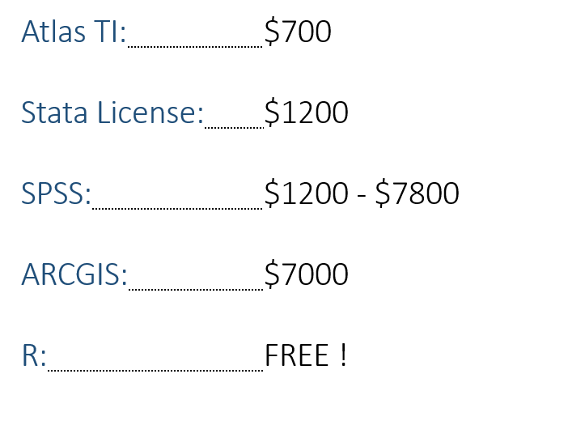

---
output:
  html_document:
    df_print: paged
    theme: paper
    highlight: haddock
    code_fold: hide
    css: vignettes.css    
---


# THREE REASONS TO USE R

```{r setup, include=FALSE}
knitr::opts_chunk$set( echo = TRUE ,  warning = F , message = F )
```


<br><br>


## 1. THE ECOSYSTEM

<br><br>



<br><br>


## 2. THE COMMUNITY

<br><br>


<br><br>


## 3. THE PRICE

<br><br>


<br><br>