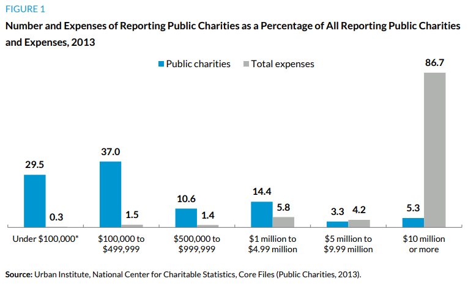

---
output:
  html_document:
    css: assets/styles.css
    self_contained: TRUE
    code_folding: show
    toc: TRUE
    toc_float: TRUE
---


```{r setup, include=FALSE}

# Turn off messages
knitr::opts_chunk$set( message=FALSE, warning=FALSE )


# Turn off scientific notation
options(scipen = 999)

```


<div id="header">


## Creating "The Nonprofit Sector in Brief": Figure 1

<br>
<br>


**Brice McKeever**

*Center on Nonprofits and Philanthropy*

*The Urban Institute*

*November 10, 2017*

<br>
<br>


# Introduction

The code presented in this document is used to create an updated version of "Figure 1: Number and Expenses of Reporting Public Charities as a Percentage of All Reporting Public Charities and Expenses" from The Urban Institute's ["The Nonprofit Sector in Brief, 2015"](https://www.urban.org/research/publication/nonprofit-sector-brief-2015-public-charities-giving-and-volunteering).

This figure is derived from data in the National Center for Charitable Statistics Core Files (Public Charities).  The code presented here assumes the use of the 2015 NCCS Core PC 2015 file (the most recent file available as of the time of this publication).  However, all the code is intended to be easily transferable to other years.


## Load R Libraries

The R code used in this example will make use of the following code libraries.

```{r message=FALSE, warning=FALSE}


# install.packages( c("httr","tidyverse","stringr","RCurl","reshape2","RColorBrewer","extrafont","knitr") )

library( httr )
library( tidyverse )
library( stringr )
library( RCurl )
library( reshape2 )
library( RColorBrewer )
library( extrafont )
library( knitr )
```


## Add Style Guide 

The following code will use the Urban Institute's style guide as a default template for all figures created here.  Although not mandatory, it will format all figures to a similar style as that used in "The Nonprofit Sector in Brief, 2015."

```{r}
source('https://raw.githubusercontent.com/UrbanInstitute/urban_R_theme/master/urban_theme_windows.R')
```


# Creating the Graph


## Skipping Data Steps

The full data steps are below, but the file is large and takes a long time to download. If you want to run through the example, use the pre-generated table.

See the full set of data steps below to re-create the graphic from the raw files.

```{r}

Figure1_2015 <- 
structure(list(year_of_data = c("2015", "2015", "2015", "2015", 
"2015", "2015", "2015"), EXPCAT = structure(c(1L, 2L, 3L, 4L, 
5L, 6L, NA), .Label = c("a. Under $100,000", "b. $100,000 to $499,999", 
"c. $500,000 to $999,999", "d. $1 million to $4.99 million", 
"e. $5 million to $9.99 million", "f. $10 million or more"), class = "factor"), 
    `Public charities` = c(29.7, 36.9, 10.3, 14.2, 3.2, 5.3, 
    0.3), `Total expenses` = c(0.3, 1.5, 1.3, 5.4, 3.9, 82.8, 
    4.9)), class = c("tbl_df", "tbl", "data.frame"), row.names = c(NA, 
-7L), .Names = c("year_of_data", "EXPCAT", "Public charities", 
"Total expenses"))

```

<br>


## Creating Figure 1

R's preferred graphics package, **ggplot2**, is used to convert the underlying data into Figure 1.


```{r}


subtitle.text <- paste("Number and Expenses of Reporting Public Charities as a Percentage of All\nReporting Public Charities and Expenses, ", 
                       Figure1_2015$year_of_data[1], sep ="")

caption.text <- paste("Urban Institute, National Center for Charitable Statistics, Core Files (Public Charites, ", 
                      Figure1_2015$year_of_data[1], ")", sep ="")

Figure1_2015 %>%    

  melt() %>%       #shift from wide to long format

  
  ggplot( aes(EXPCAT, value, fill=variable) ) +
  
    geom_bar( stat="identity", position="dodge" ) +
  
    geom_text( aes(EXPCAT, value, label=value), 
               vjust=-1, position = position_dodge(width=1) ) +
  
    labs(title = "Figure 1",
         subtitle =  subtitle.text,
         caption = caption.text ) +
  
    scale_x_discrete( labels = c("a. Under $100,000" = "Under $100,000", 
                                 "b. $100,000 to $499,999" = "$100,000 to\n$499,999", 
                                 "c. $500,000 to $999,999" = "$500,000 to\n$999,999", 
                                 "d. $1 million to $4.99 million" = "$1 million to\n$4.99 million", 
                                 "e. $5 million to $9.99 million" = "$5 million to\n $9.99 million", 
                                 "f. $10 million or more" = "$10 million\nor more") ) +
  
    scale_y_continuous(limits = c(0,100), expand = c(0, 0)) +
  
    theme( axis.title.y = element_blank(),
           axis.text.y = element_blank(),
           axis.ticks.y = element_blank(),
           axis.title.x = element_blank(),
           panel.grid = element_blank() ) 

```


<br>
<br>

Compare this figure to the figure available for 2013 data, as described in "The Nonprofit Sector in Brief, 2015":
<https://www.urban.org/sites/default/files/publication/72536/2000497-The-Nonprofit-Sector-in-Brief-2015-Public-Charities-Giving-and-Volunteering.pdf>

<br>
<br>



<br>
<br>

We now have a custom reproducable graphic that can be used to generate reports in a consistent and timely fashion.

<br>
<br>
<br>
<br>


# Full Data Steps


## Download the 2015 NCCS Core PC File

Users can find the most recent NCCS Core file data at the NCCS Data Archive: <http://nccs-data.urban.org>.  

The NCCS Data Archive contains all of the IRS Business Master Files, NCCS Core Files, Digitized Data Files, and IRS Statistics of Income Division Exempt Organizations Sample Files previously accessed through registration on <http://nccsweb.urban.org>.  The files hosted on the NCCS Data Archive are presented free of charge as a service to the research community, and accessible without registration.  All files are presented in CSV file format for easy download and access.  


```{r, eval=F}

core2015pc <- read.csv( "http://nccs-data.urban.org/data/core/2015/nccs.core2015pc.csv" )

```

If you want to fine-tune control of what data is downloaded you can specify variables and data types in your download step.

The function defined below is used to download and extract some of the most popular fields from the NCCS Core PC files for use in R, including the fields that will be used in Figure 1 (and other tables and figures in the Nonprofit Sector in Brief).  A full listing of available fields is accessible at <http://nccs-data.urban.org/data-dictionaries.php>.  (Note that as of this writing, the 2015 Data Dictionary is not yet available.  However, the fields for the 2013 data dicationary are applicable for 2015.)

Next, that function is used to pull the NCCS Core 2015 file by referring to its specific URL on the NCCS Data Archive.


```{r message = FALSE, warning = FALSE, eval=F}

getcorefile <- function(URL) {
  rawdata <- GET(URL)
  output <- content(rawdata, type = "text/csv", 
                    col_types = cols_only(EIN = col_character(),
                                          FISYR = col_integer(),
                                          NAME = col_character(),
                                          STATE = col_character(),
                                          ADDRESS = col_character(),
                                          CITY = col_character(),
                                          ZIP = col_character(),
                                          MSA_NECH = col_character(),
                                          PMSA = col_character(),
                                          STYEAR = col_double(),
                                          TAXPER = col_integer(),
                                          OUTNCCS = col_character(),
                                          SUBSECCD = col_character(),
                                          RULEDATE = col_character(),
                                          FNDNCD = col_character(),
                                          FRCD = col_character(),
                                          TOTREV = col_double(),
                                          EXPS = col_double(),
                                          ASS_EOY = col_double(),
                                          GRREC = col_double()
                    ))
  names(output) <- toupper(names(output))
  return(output)
}

core2015pc <- getcorefile("http://nccs-data.urban.org/data/core/2015/nccs.core2015pc.csv")

```


## Download File for Faster Load Time

When using the same file repeatedly, downloading large files like the NCCS Core Files from the NCCS Data Archive every time is both time consuming and inefficient.  The following code will write a CSV copy of the reduced file to a local directory.  

```{r, warning = FALSE, eval=F}

download.file( "http://nccs-data.urban.org/data/core/2015/nccs.core2015pc.csv", "core2015pc.csv" ) 
              
core2015pc <- read_csv("core2015pc.csv",
                       col_types = cols_only(EIN = col_character(),
                                             FISYR = col_integer(),
                                             NAME = col_character(),
                                             STATE = col_character(),
                                             ADDRESS = col_character(),
                                             CITY = col_character(),
                                             ZIP = col_character(),
                                             MSA_NECH = col_character(),
                                             PMSA = col_character(),
                                             STYEAR = col_double(),
                                             TAXPER = col_integer(),
                                             OUTNCCS = col_character(),
                                             SUBSECCD = col_character(),
                                             RULEDATE = col_character(),
                                             FNDNCD = col_character(),
                                             FRCD = col_character(),
                                             TOTREV = col_double(),
                                             EXPS = col_double(),
                                             ASS_EOY = col_double(),
                                             GRREC = col_double()
                       ))
```


## Create expense category groupings

The purpose of Figure 1 of "The Nonprofit Sector in Brief"" is to analyze the NCCS Core PC data as grouped by several size categories (as measured by expenses).  The first step is to define a function to classify the total expenses for a given nonprofit (as given in the NCCS Core PC files by the variable "EXPS") into one of several categories.

```{r, eval=F}

category.labels <- c( "a. Under $100,000", "b. $100,000 to $499,999", "c. $500,000 to $999,999",
                      "d. $1 million to $4.99 million", "e. $5 million to $9.99 million", "f. $10 million or more" )

core2015pc$EXPCAT <- cut( core2015pc$EXPS, breaks=c(0,100000,500000,1000000,5000000,10000000,10000000000), labels=category.labels )

```


```{r, eval=F}

# This function is used to classify the data in the 2015 Core PC file.


EXPclassify <-function(dataset) {
  dataset$EXPCAT <- " "
  dataset$EXPCAT[ dataset$EXPS <  100000 ] <- "a. Under $100,000"
  dataset$EXPCAT[ dataset$EXPS >= 100000 & dataset$EXPS< 500000] <- "b. $100,000 to $499,999"
  dataset$EXPCAT[ dataset$EXPS >= 500000 & dataset$EXPS< 1000000] <- "c. $500,000 to $999,999"
  dataset$EXPCAT[ dataset$EXPS >= 1000000 & dataset$EXPS< 5000000] <- "d. $1 million to $4.99 million"
  dataset$EXPCAT[ dataset$EXPS >= 5000000 & dataset$EXPS< 10000000] <- "e. $5 million to $9.99 million"
  dataset$EXPCAT[ dataset$EXPS >= 10000000] <- "f. $10 million or more"
  return(dataset)
}


core2015pc <-EXPclassify(core2015pc)

```

While in this instance these categories are being used to define the Core 2015 PC file, the purpose of this standardized code is to make similar analysis for any other year as smooth (and reproducible) as possible.


## Cleaning Data

Now that the data has been properly classified, the raw Core PC file is used to aggregate the underlying data for Figure 1.

Note the filters at the beginning of the function.  These filters are standard for the majority of reports published by the National Center for Charitable Statistics.  First, organizations that would not be required to file a Form 990 or 990-EZ due to having gross receipts under the minimum reporting threshold are filtered out.  This restricts the analysis solely to "active and reporting" public charities. Next the function also filters to remove private foundations, as well as organizations deemed "out of scope" (typically: foreign organizations).

```{r, eval=F}


Fig1Table <- function( datayear ) 
{ 
  file <-  c(paste("core", datayear, "pc", sep =""))
  dataset <- get(file)
  #if data from 2010 or later, use new filing threshold for 990-EZ ($50,000 or more in gross receipts/total revenue)
  #if data from before 2010, use old filing threshold for 990-EZ ($25,000 or more in gross receipts/total revenue)  
  dataset <- if(datayear < 2010) filter(dataset, ((GRREC >= 25000)|(TOTREV>25000))) else filter(dataset, ((GRREC >= 50000)|(TOTREV>50000)))
  expstable <- dataset %>% 
    #filter to remove out of scope (often foreign) organizations
    filter(OUTNCCS != "OUT") %>% 
    #filter to remove private foundations
    filter((FNDNCD != "02" & FNDNCD!= "03" & FNDNCD != "04")) %>% 
    #group by expense categories
    group_by(EXPCAT) %>%
    #create summary values
    summarize( 
      number_orgs = n(),
      total_expenses = round((sum(EXPS, na.rm =TRUE)/1000000000), digits =2)
    ) %>% 
    #drop old variables, keep only categories and proportions
    transmute(
      year_of_data = as.character(datayear),
      EXPCAT = EXPCAT,
      "Public charities" = round(((number_orgs/sum(number_orgs))*100),digits=1),
      "Total expenses" = round(((total_expenses/sum(total_expenses))*100),digits=1)
    )  
  
  return(expstable)
  
}


Figure1_2015 <- Fig1Table(2015)


```


The resulting table looks like this:

``````{r echo = FALSE, message = FALSE, warning = FALSE, results = 'asis'}

kable( Figure1_2015 )

```


## Creating Figure 1

Finally, R's ggplot2 functionality is used to convert the underlying data into Figure 1.

```{r}

Fig1Plot <- function(expstable) {
  expstable %>%  
    #shift from wide to long
    melt() %>% 
    #create graph
    ggplot(aes(EXPCAT, value, fill=variable))+
    geom_bar(stat="identity", position="dodge") +
    geom_text(aes(EXPCAT, value, label=value),vjust=-1, 
              position = position_dodge(width=1)) +
    labs(title = "Figure 1",
         subtitle =  paste("Number and Expenses of Reporting Public Charities as a Percentage of All\nReporting Public Charities and Expenses, ", expstable$year_of_data[1], sep =""),
         caption = paste("Urban Institute, National Center for Charitable Statistics, Core Files (Public Charites, ", expstable$year_of_data[1], ")", sep ="")) +
    scale_x_discrete(labels = c("a. Under $100,000" = "Under $100,000", 
                                "b. $100,000 to $499,999" = "$100,000 to\n$499,999", 
                                "c. $500,000 to $999,999" = "$500,000 to\n$999,999", 
                                "d. $1 million to $4.99 million" = "$1 million to\n$4.99 million", 
                                "e. $5 million to $9.99 million" = "$5 million to\n $9.99 million", 
                                "f. $10 million or more" = "$10 million\nor more")) +
    scale_y_continuous(limits = c(0,100), expand = c(0, 0)) +
    theme(axis.title.y = element_blank(),
          axis.text.y = element_blank(),
          axis.ticks.y = element_blank(),
          axis.title.x = element_blank(),
          panel.grid = element_blank()) 
}


Fig1Plot( Figure1_2015 )


```

Compare this figure to the figure available for 2013 data, as described in "The Nonprofit Sector in Brief, 2015":
<https://www.urban.org/sites/default/files/publication/72536/2000497-The-Nonprofit-Sector-in-Brief-2015-Public-Charities-Giving-and-Volunteering.pdf>


